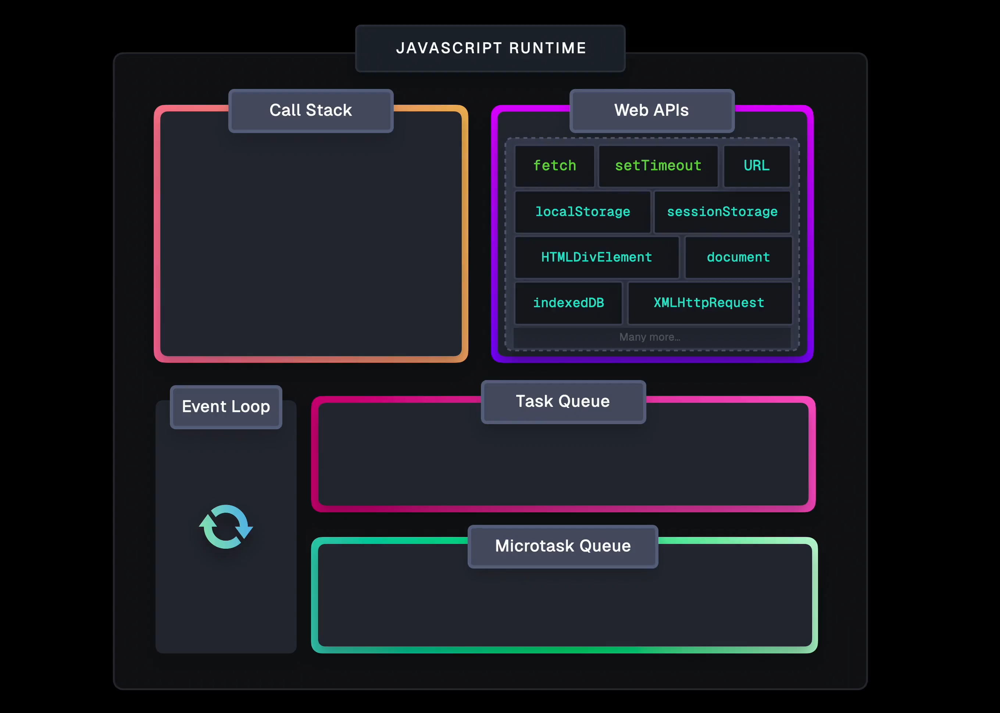
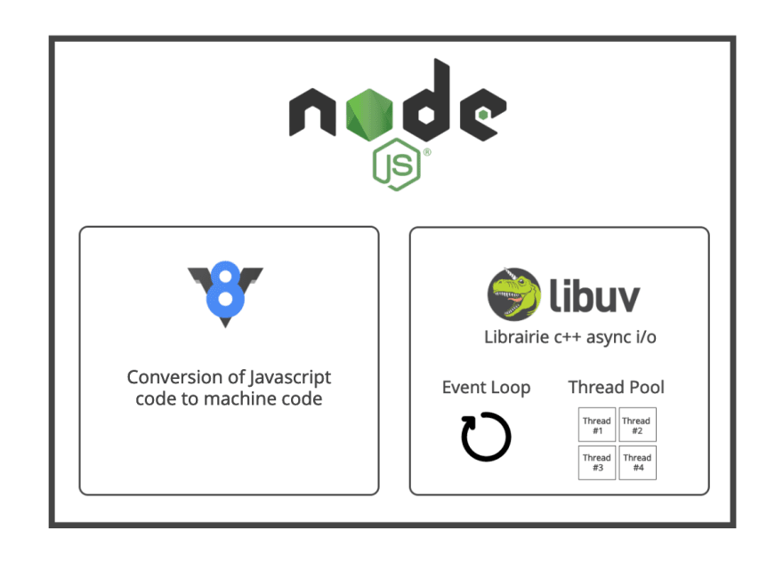
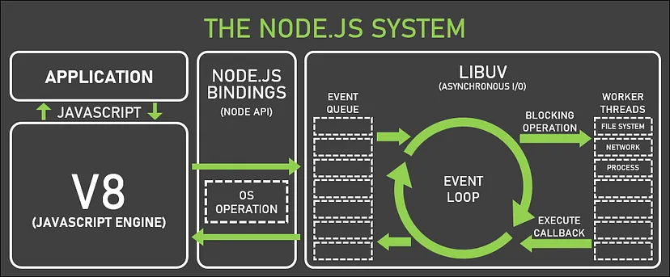

# Eventloop

пояснює, як середовище виконання може бути асинхронним і мати неблокуючий `I/O` (ввід/вивід)

## Черга виконання

1.  Синхронний код
2.  Всі мікротаски

- `promise` 's
- `mutationObserver`

3. Одна макротаска

- `setTimeout`
- `setInterval`
- Events (click..)

4. Всі мікротаски

- [...second]

5. Одна макротаска

- [...third]

## Browsers

`Web APIs` надають набір інтерфейсів для взаємодії з функціями, які використовує браузер. Сюди входить функціональність, яку ми часто використовуємо при створенні за допомогою JavaScript, наприклад, `Document Object Model`, `fetch`, `setTimeout` і багато іншого.

`Web APIs` по суті діють як міст між середовищем виконання JavaScript і функціями браузера, дозволяючи нам отримувати доступ до інформації та використовувати функції, що виходять за рамки можливостей самого JavaScript.

## Node.js

`V8` рушій дбає про перетворення JavaScript коду у машинний код. Після перетворення коду в машинний код, виконанням буде керувати бібліотека `libuv`

`libuv` реалізує дві дуже важливі можливості NodeJS: цикл обробки подій та пул потоків. `Libuv` — це бібліотека, яка відповідає за асинхронне введення/виведення I/O –операцій в Node.js. Але одна з головних задач libuv — це зробити Node.js сумісною з більшістью оперативних систем (OS) для нормалізації не блокуючих операцій.

`V8 : C++` `Libuv : C`

